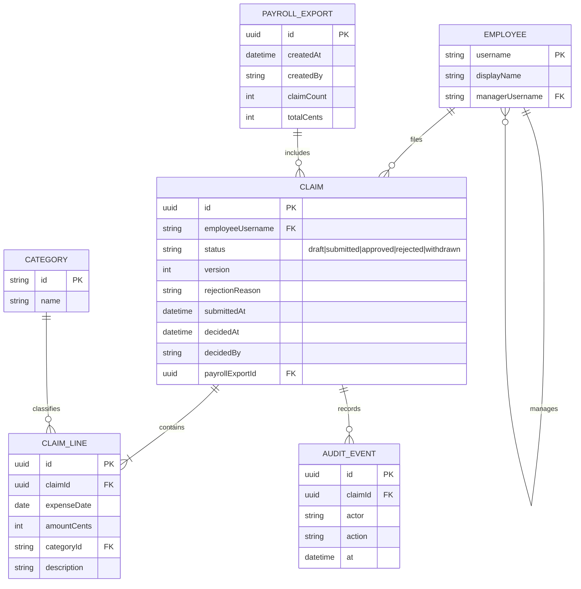

# Domain model

Employees file expense claims made of lines; the claim is decided as a whole by the employee's line manager, and approved claims are collected into payroll export batches. All amounts are integer cents in the single company currency.

- A claim total is the sum of its lines' `amountCents`; it is derived, never stored separately.
- `managerUsername` is the line-manager relation behind `/me/team/claims`; it is meant to come from the organization's people directory.
- `AUDIT_EVENT` rows are written for every submission, edit, withdrawal, decision and export (P2); no screen reads them.
- A claim is exported at most once: `payrollExportId` is set when a batch includes it.