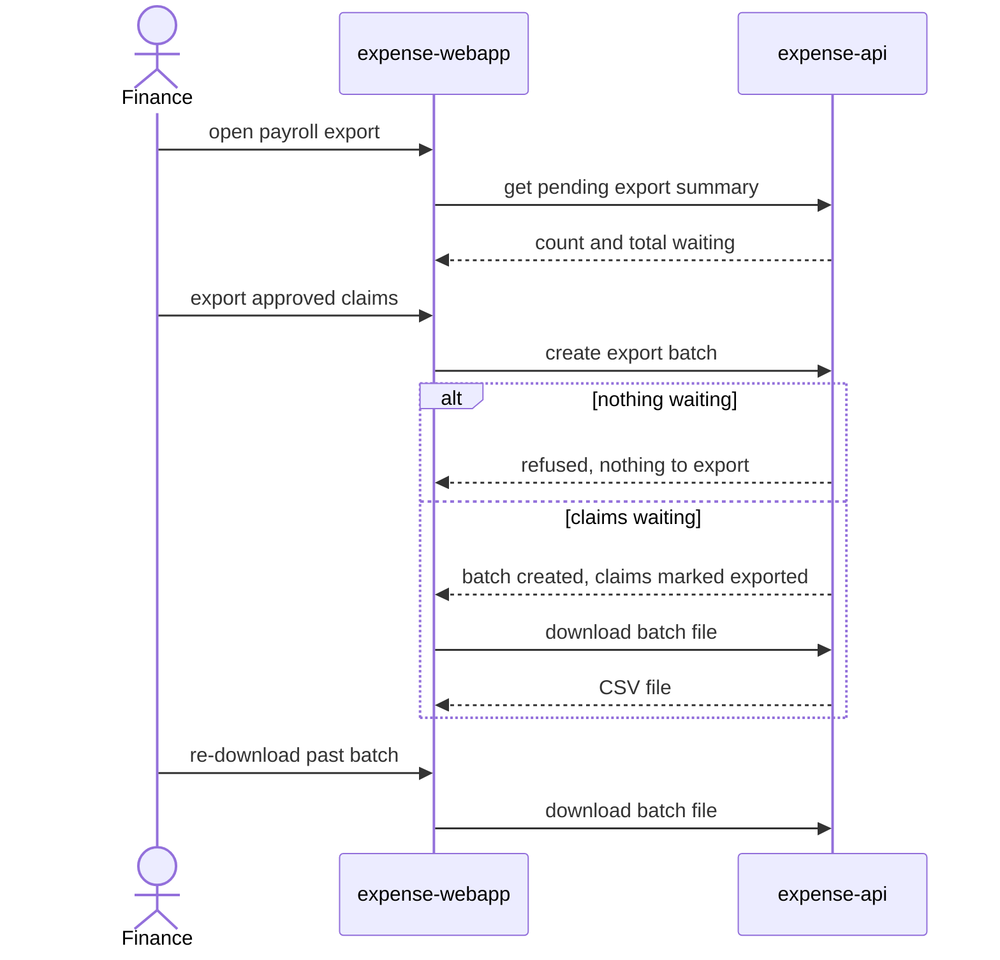

# Export approved claims to payroll

Finance reviews what is waiting, exports every approved claim not yet exported as one CSV batch, and can download any earlier batch again.

```mermaid
sequenceDiagram
    actor Finance
    participant expense-webapp
    participant expense-api

    Finance->>expense-webapp: open payroll export
    expense-webapp->>expense-api: get pending export summary
    expense-api-->>expense-webapp: count and total waiting
    Finance->>expense-webapp: export approved claims
    expense-webapp->>expense-api: create export batch
    alt nothing waiting
        expense-api-->>expense-webapp: refused, nothing to export
    else claims waiting
        expense-api-->>expense-webapp: batch created, claims marked exported
        expense-webapp->>expense-api: download batch file
        expense-api-->>expense-webapp: CSV file
    end
    Finance->>expense-webapp: re-download past batch
    expense-webapp->>expense-api: download batch file
```