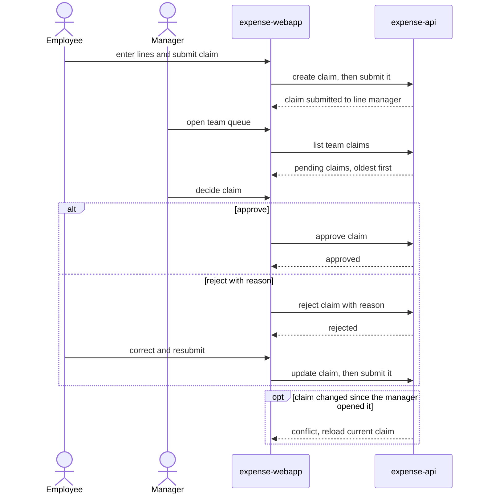

# Submit and approve a claim

An Employee files a claim and submits it; their Manager approves it, or rejects it with a reason and the Employee corrects and resubmits.

```mermaid
sequenceDiagram
    actor Employee
    actor Manager
    participant expense-webapp
    participant expense-api

    Employee->>expense-webapp: enter lines and submit claim
    expense-webapp->>expense-api: create claim, then submit it
    expense-api-->>expense-webapp: claim submitted to line manager
    Manager->>expense-webapp: open team queue
    expense-webapp->>expense-api: list team claims
    expense-api-->>expense-webapp: pending claims, oldest first
    Manager->>expense-webapp: decide claim
    alt approve
        expense-webapp->>expense-api: approve claim
        expense-api-->>expense-webapp: approved
    else reject with reason
        expense-webapp->>expense-api: reject claim with reason
        expense-api-->>expense-webapp: rejected
        Employee->>expense-webapp: correct and resubmit
        expense-webapp->>expense-api: update claim, then submit it
    end
    opt claim changed since the manager opened it
        expense-api-->>expense-webapp: conflict, reload current claim
    end
```